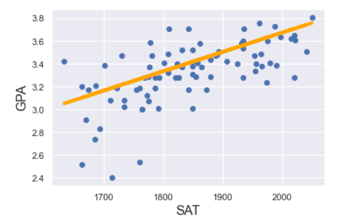
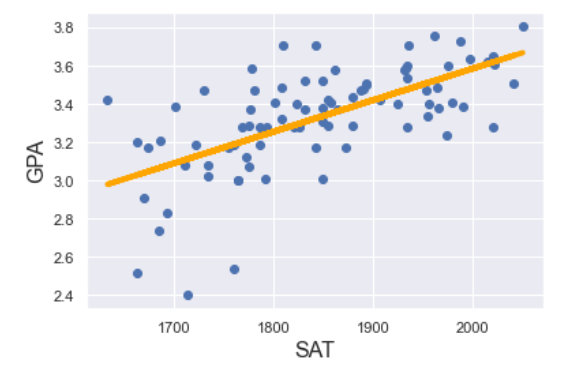

## Jupyter Notebooks

 

### Simple Linear Regression with StatsModels

[This example](./simple_linear_regression_with_statsmodels/readme.md) showcases how an example.
The result is:

 

### Multiple Linear Regression with StatsModels

[This example](./multiple_linear_regression_and_adj_r-squared/readme.md) shows that adding an insignificat independent variable does not help.

 

### Simple Linear Regression with sklearn

[This example](./simple_linear_regression_with_sklearn/readme.md) showcases the same usage of a linear regression, this time using sklearn. The result is:

 
